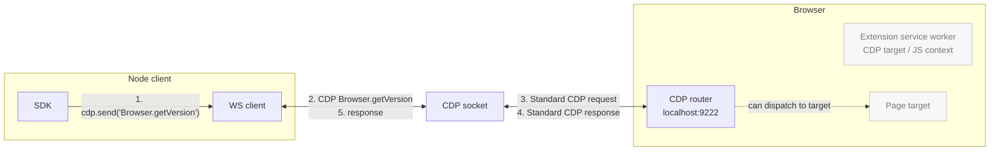
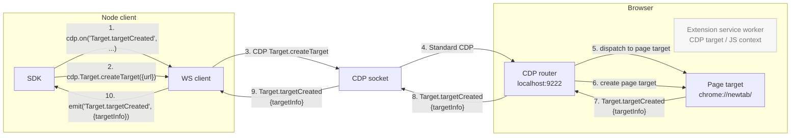
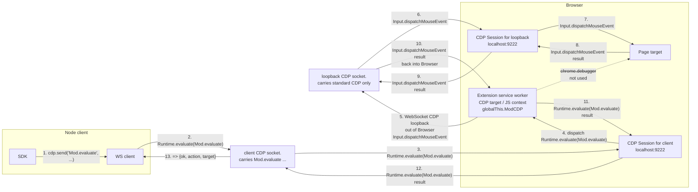
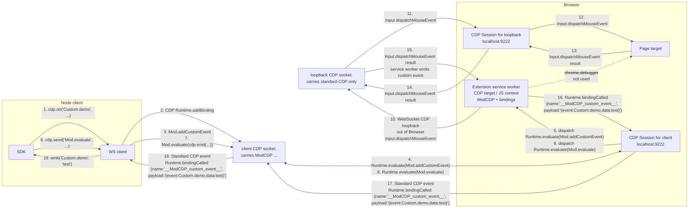

# ModCDP

CDP is powerful but it's been stretched to many use-cases beyond its initial audience. It is difficult for agents and humans to use without a harness library, because:

- lacks the ability to use it statelessly without maintaining mappings of sessionIds, targetIds, frameIds, execution context IDs, backendNodeId ownership, and event listeners

- lacks the ability to register custom CDP commands, abstractions, and events

- lacks the ability to easily call chrome.\* extension APIs for things like `chrome.tabs.query({ active: true })`

- _lacks the ability to reference pages and elements with stable references across browser runs, such as XPath, URL, and frame index, instead of unstable identifiers like sessionId, targetId, frameId, backendNodeId_ (unrealistic dream? maybe not)

While I had high hopes for WebDriver BiDi, unfortunately it solves almost none of these issues.

ModCDP does not aim to solve all of these issues directly either. Instead it solves a simpler problem: allowing us to customize and extend CDP with new commands.
Then we use those basic primitives to fix the shortcomings in CDP by implementing our own custom events (all sent over a normal CDP websocket to a stock Chromium browser).

| Primitive              | What it does                                                                                          |
| ---------------------- | ----------------------------------------------------------------------------------------------------- |
| `Mod.evaluate`         | Run an expression in the ModCDP extension service worker, with `chrome.*` and a `cdp` bridge in scope |
| `Mod.addCustomCommand` | Register a `Custom.*` method handler that lives in the SW                                             |
| `Mod.addCustomEvent`   | Register a `Custom.*` event your SW handlers can `emit()`                                             |
| `Mod.addMiddleware`    | Intercept service-worker-routed requests, responses, or events by name or `*`                         |

Instead of inventing yet another browser driver library, ModCDP fixes the issue at the root.

It's perfectly compatible with playwright, puppeteer, etc. with no modifications. You can do things like `patchright` does, but generically at the CDP layer instead of having to patch libraries.

You can send `Mod.*`, `Custom.*`, etc. through standard Playwright/Puppeteer/other-driver-managed CDP sessions; `js/examples/demo.ts`, `python/examples/demo.py`, and `go/examples/demo/main.go` demonstrate the flow in each language.

## Use it

```ts
import { ModCDPClient } from "modcdp";
import { z } from "zod";

const upstream_ws_cdp_url = "http://127.0.0.1:9222"; // host:port, http(s), and ws(s) URLs work
const cdp = new ModCDPClient({
  launcher: { launcher_mode: "remote" },
  upstream: { upstream_mode: "ws", upstream_ws_cdp_url },
  injector: { injector_mode: "discover" },
  router: { router_routes: { "Target.getTargets": "service_worker" } },
  server_config: {
    upstream: { upstream_ws_cdp_url },
    router: { router_routes: { "*.*": "loopback_cdp" } },
  },
});
await cdp.connect();

// use it like a normal CDP connection, send normal CDP, register for normal CDP events
console.log(await cdp.Browser.getVersion());
cdp.on(cdp.Target.targetInfoChanged, console.log);

// run extension code with chrome.* in scope
const tab = await cdp.Mod.evaluate({
  expression: "(await chrome.tabs.query({ active: true }))[0]",
});

// ✨ register and use custom CDP commands
await cdp.Mod.addCustomCommand({
  name: "Custom.tabIdFromTargetId",
  params_schema: { targetId: cdp.types.zod.Target.TargetID },
  result_schema: { tabId: z.number().nullable() },
  expression: `async ({ targetId }) => ({
    tabId: (await chrome.debugger.getTargets()).find(t => t.id === targetId)?.tabId ?? null
  })`,
});
const { targetInfos } = await cdp.Target.getTargets();
const pageTarget = targetInfos.find((targetInfo) => targetInfo.type === "page");
console.log(await cdp.send("Custom.tabIdFromTargetId", { targetId: pageTarget.targetId })); // -> { tabId: 22352432 }

// ✨ set up new custom CDP events to fire + receive them just like normal CDP
// this example sets up a truly accurate "foreground focus" tracking event,
// which CDP doesn't have natively https://issues.chromium.org/issues/497896141
const PageForegroundPageChanged = z
  .object({
    targetId: cdp.types.zod.Target.TargetID.nullable(),
    tabId: z.number(),
  })
  .passthrough()
  .meta({ id: "Page.foregroundPageChanged" });

await cdp.Mod.addCustomEvent(PageForegroundPageChanged);
await cdp.Mod.evaluate({
  expression: `chrome.tabs.onActivated.addListener(async ({ tabId }) =>
    cdp.emit("Page.foregroundPageChanged", {
      tabId,
      targetId: (await chrome.debugger.getTargets()).find(t => t.tabId === tabId)?.id ?? null
    })
  )`,
});
cdp.on(PageForegroundPageChanged, console.log);

// ✨ Intercept, modify, and extend existing CDP commands/results/events on the wire
await cdp.Mod.addMiddleware({
  name: cdp.Target.getTargets,
  phase: cdp.RESPONSE,
  // attach .tabId next to every .targetId in events browser emits
  expression: `async (payload, next) => {
    for (const targetInfo of payload.targetInfos) {
      const { tabId } = await cdp.send("Custom.tabIdFromTargetId", {
        targetId: targetInfo.targetId,
      });
      targetInfo.tabId = tabId;
    }
    return next(payload);
  }`,
});
console.log(await cdp.Target.getTargets()); // TargetInfo entries now include tabId

// typed + zod-enforced imperative aliases are generated for standard CDP too
const created = await cdp.Target.createTarget({ url: "https://example.com" });
await cdp.Target.activateTarget({ targetId: created.targetId }); // triggers Page.foregroundPageChanged
console.log(created);
```

## Run the demos

Each demo launches Chrome with the fixed ModCDP extension artifact loaded, headful on macOS and `--headless=new` on Linux, then exercises raw CDP, `Mod.evaluate`, `Custom.*` commands, custom events, middleware, and latency reporting in the chosen mode. When stdin is a TTY, the demo leaves you in the same mini REPL/TUI across JS, Python, and Go.

```sh
pnpm run demo:js                    # defaults to --loopback --upstream=ws
pnpm run demo:js -- --debugger --upstream=pipe
pnpm run demo:python
pnpm run demo:go
```

The Python package is managed with `uv`; `pnpm run demo:python` runs the built demo through `uv` and does not require a separate `pip install`. Set `CHROME_PATH=/path/to/chromium` to force a specific browser binary. Native messaging mode requires Chrome to launch the configured native host; it is not a standalone shell demo mode.

## Transparent Proxy

Upgrade any vanilla CDP client like Stagehand, Playwright, or Puppeteer transparently with support for `Mod.*` / `Custom.*` commands and events.

```sh
pnpm run proxy -- --upstream-mode=ws --upstream-ws-cdp-url=http://127.0.0.1:9222 --port 9223
pnpm run proxy -- --launcher-mode=local --upstream-mode=pipe --port 9223
pnpm run proxy -- --launcher-mode=local --upstream-mode=nats --upstream-nats-url=ws://127.0.0.1:4223 --port 9223
# const browser = await playwright.chromium.connectOverCDP("http://127.0.0.1:9223")
# const session = await browser.contexts()[0].newCDPSession(page)
# await session.send("Mod.evaluate", { expression: "1 + 1" }) // -> 2
# ✨ All ModCDP commands now work through playwright! you can modify/extend playwright behavior to your heart's content
```

The proxy uses the same `--launcher-*`, `--injector-*`, `--upstream-*`, `--client-config='{"client_cdp_send_timeout_ms": 10000}'`, `--router='{"router_routes": {...}}'`, and `--server-config='{"router": {"router_routes": {...}}}'` config groups as `ModCDPClient`. CLI flags use kebab case and map to the owner-prefixed config fields, for example `--launcher-local-executable-path` maps to `launcher.launcher_local_executable_path`. `ws` keeps a transparent websocket-to-websocket fast path; `pipe`, `nativemessaging`, and `nats` proxy downstream CDP-shaped messages through the selected client-side `ModCDPClient` transport.

Native messaging mode uses the configured browser native host name directly. The baked extension expects the default `com.modcdp.bridge` host, so changing `--upstream-nativemessaging-host-name` requires using an extension build that was baked for that host. Because Chrome owns native host process launch and stdio, native messaging is not a standalone `pnpm run proxy` mode.

## Routing modes

`Mod.*` and `Custom.*` always go through the extension service worker. Routing only changes how _standard_ CDP methods (`Browser.*`, `Page.*`, `DOM.*`, …) are serviced:

| Demo CLI Flag | Standard CDP path                                                  | Use when                                                                        |
| ------------- | ------------------------------------------------------------------ | ------------------------------------------------------------------------------- |
| `--loopback`  | client → SW → SW dials its own WS back to localhost:9222 → CDP     | Default. You need the SW to intercept/inspect/rewrite normal traffic.           |
| `--debugger`  | client → SW → `chrome.debugger.sendCommand` against the active tab | The browser exposes no remote CDP port and you only have extension permissions. |
| `--direct`    | client → sends non-ModCDP commands to browser CDP directly         | You already have a CDP endpoint and don't need extension interception.          |

Pass via `router: { router_routes: { "*.*": "direct_cdp" | "service_worker" } }` and `server_config: { router: { router_routes: { "*.*": "loopback_cdp" | "chromedebugger" } } }`. The demos default to `--loopback` (the most powerful mode).

## Repository layout

```
extension/                MV3 extension shell and static pages
  manifest.json
  src/
  pages/
js/                       TypeScript client/server/proxy package
  src/
    client/
    server/
    launcher/
    injector/
    transport/
    router/
    translate/
    proxy/
    types/
  examples/
  test/
python/                   Python package, examples, and tests
  modcdp/
    client/
    launcher/
    injector/
    transport/
    router/
    translate/
    types/
go/                       Go module, examples, and tests
  modcdp/
    client/
    launcher/
    injector/
    transport/
    router/
    translate/
    types/
dist/                     Built JS output used by the extension and Node CLI scripts
```

## Requirements

- Stock Google Chrome can be used without relaunch flags: visit `chrome://inspect/#remote-debugging` to expose the current browser at `http://127.0.0.1:9222`, and load/install the ModCDP extension in that profile. Pass that endpoint as `upstream: { upstream_mode: "ws", upstream_ws_cdp_url: "http://127.0.0.1:9222" }`.
- Automated/test browsers need the extension-loading path that their Chrome build actually supports. Chrome for Testing currently supports `--load-extension=<path>` and may not expose `Extensions.loadUnpacked`; Canary 150 exposes `Extensions.loadUnpacked` and does not load this MV3 extension through `--load-extension` in the local headless test path.
- Node ≥ 22, Python ≥ 3.11 with `websocket-client`, Go ≥ 1.25 with `gobwas/ws`.

---

<details>
<summary><b>Architecture &amp; lifecycle</b></summary>

### Connect

1. Select a `launcher` class and an `upstream` transport. `launcher.launcher_mode="local"` starts a local browser, `launcher.launcher_mode="remote"` uses the supplied `upstream.upstream_ws_cdp_url`, and `launcher.launcher_mode="none"` leaves browser lifecycle outside ModCDP.
2. The configured extension injector classes try discovery, launch-arg injection, Browserbase upload, `Extensions.loadUnpacked`, or borrowing in the configured order.
3. Attach a session to that SW target and `Runtime.enable` on it.
4. Call `globalThis.ModCDP.configure(...)` to push the resolved loopback websocket and any explicit server route overrides into the SW. The clients do this automatically by default.

### Send

- `Mod.evaluate({ expression, params, cdpSessionId })` → `Runtime.evaluate` on the ext session, wrapping the expression with an IIFE that exposes `params` and `cdp = ModCDP.attachToSession(...)`.
- `Mod.addCustomCommand({ name, expression, ... })` → `Runtime.evaluate` calling `globalThis.ModCDP.addCustomCommand({ ... })` with the user expression embedded as the handler.
- `Mod.addCustomEvent(EventSchema.meta({ id }))` → `Runtime.evaluate` registering the event in `globalThis.ModCDP`; all custom events are delivered through the single `__ModCDP_custom_event__` binding installed at connect time.
- `Mod.addMiddleware({ name, phase, expression })` → `Runtime.evaluate` registering a service-worker middleware for `phase: "request" | "response" | "event"`. Use `name: "*"` to match every method/event in that phase, or pass generated names like `cdp.Target.targetInfoChanged`.
- `Custom.X(params)` → `Runtime.evaluate` calling `globalThis.ModCDP.handleCommand("Custom.X", params, cdpSessionId)`.

### Receive

When SW handlers `cdp.emit('Custom.X', payload)`, the SW invokes `globalThis.__ModCDP_custom_event__(JSON.stringify({ event, data, cdpSessionId }))`. CDP delivers `Runtime.bindingCalled` on the ext session; the client (or proxy) decodes the payload and re-dispatches it as a normal `cdp.on('Custom.X', ...)` event.

### Why this works

`Runtime.addBinding` is the only out-of-page → in-page → out-of-page channel CDP exposes. Combined with one extension service worker (which gets `chrome.*` access as a side effect of being in an extension), you get:

- A guaranteed JS execution context that's not a page, with the right permissions
- A way to push named events back through the same CDP socket your client already speaks
- The same command/event surface whether the bytes arrive by websocket, pipe, native messaging, or NATS.

</details>

<details>
<summary><b>Routing details</b></summary>

```ts
type CDPUpstream = "service_worker" | "direct_cdp" | "auto" | "loopback_cdp" | "chromedebugger";

// client-side defaults
const client_routes = { "Mod.*": "service_worker", "Custom.*": "service_worker", "*.*": "service_worker" } as const;

// server-side defaults (inside the SW)
const server_router_routes = { "Mod.*": "service_worker", "Custom.*": "service_worker", "*.*": "auto" } as const;
```

- **`service_worker`** — handle in the extension SW.
- **`direct_cdp`** (client only) — send straight to the browser CDP websocket.
- **`auto`** (server only) — try `loopback_cdp` first, fall back to `chromedebugger`.
- **`loopback_cdp`** (server only) — SW dials a CDP websocket reachable from the browser. You may pass `http://host:port` as shorthand, but it is resolved to the concrete `ws://.../devtools/...` URL at configuration time. Useful for `Browser.*` commands that `chrome.debugger` doesn't support.
- **`chromedebugger`** (server only) — `chrome.debugger.sendCommand` against `params.debuggee || { tabId, targetId, extensionId }`, defaulting to the active last-focused tab.

Route resolution is **deterministic across all three language clients**: exact-method match → longest-prefix wildcard → `*.*` fallback. This avoids map-iteration nondeterminism (Go) and key-insertion-order shadowing (JS/Python).

When server-side `auto` routing tries loopback CDP discovery, the SW only trusts `127.0.0.1:9222` after verifying a per-connection `server_config.server_browser_token` against its own service-worker target. It will not accidentally route loopback commands through a different browser that happens to have the same extension installed.

</details>

<details>
<summary><b>Wire diagrams</b></summary>

#### 1. Normal CDP Call / Response



#### 2. Normal CDP Event Listener / Event



#### 3. ModCDP Custom Call / Response



The same transport shape applies to `Mod.addCustomCommand`: the client installs a named command handler in the service worker, and later `cdp.send('Custom.someCommand', params)` is routed back through `globalThis.ModCDP.handleCommand(...)`.

#### 4. ModCDP Custom Event Listener / Event



</details>

<details>
<summary><b>Constraints &amp; alternatives explored</b></summary>

**Constraints**

- This does not add real CDP methods to Chrome — the wire methods stay `Runtime.evaluate` + `Runtime.bindingCalled`. The `Mod.*` / `Custom.*` namespace is a client + SW convention.
- Page JS does not see custom commands or event bindings.
- Stock Google Chrome's `chrome://inspect/#remote-debugging` toggle can expose the current browser at `localhost:9222` without relaunching with `--remote-debugging-port`, `--enable-unsafe-extension-debugging`, or `--remote-allow-origins=*`.
- If `Extensions.loadUnpacked` is unavailable in the connected browser, load/install the ModCDP extension in that Chrome profile once and reconnect; the injector will use the discovery path.

**Alternatives considered**

- `chrome.debugger` — used as the server-side fallback, but doesn't expose other connected CDP clients or the raw protocol stream.
- Extension WebSocket → pass the actual `ws://.../devtools/browser/...` CDP endpoint directly; HTTP `/json/*` discovery is only a compatibility fallback for `http://host:port` shorthand.
- Listening to another CDP client's traffic — separate clients don't see each other's messages.
- WebMCP — page-visible/tool-oriented, unsuitable when page JS must not detect the control plane.
- `Extensions.*` storage mailbox — slower and more brittle than the SW target.
- A separate local CDP proxy process — clean, but unnecessary for the default flow; the proxy here is opt-in (only used when "upgrading" a vanilla CDP client).

</details>

<details>
<summary><b>Latency (local PoC, headless Chromium 141)</b></summary>

```
launchToFirstBrowserGetVersion:      1262.6 ms
normalBrowserGetVersionRoundTrip:       0.7 ms
smuggledCustomPingRoundTrip:            9.3 ms
normalOnSubscribeTriggerEvent:          1.8 ms
smuggledCustomOnSubscribeTriggerEvent: 29.6 ms
```

Custom roundtrip overhead is dominated by `Runtime.evaluate` + the SW's loopback CDP dial, not by wrap/unwrap. Avoid `auto` discovery in latency-sensitive paths if you can pre-configure `loopback_cdp_url` directly.

</details>

<details>
<summary><b>macOS Chrome compatibility notes (tested 2026-05-27)</b></summary>

Latest local extension-loading probe:

| Browser | Version | `--load-extension=<dist/extension>` | `Extensions.loadUnpacked` |
| --- | --- | --- | --- |
| Chrome Canary | `150.0.7859.0` | no ModCDP service worker target appeared | returned `mdedooklbnfejodmnhmkdpkaedafkehf`; service worker target appeared |
| Playwright Chrome for Testing | `148.0.7778.96` | service worker target appeared | `Method not available.` |

Practical guidance:

- Use `injector_mode: "cdp"` / `Extensions.loadUnpacked` for Canary 150 when loading the extension into an already-running local browser over CDP.
- Use `injector_mode: "cli"` / `--load-extension=<path>` with Chrome for Testing, Linux `/usr/bin/chromium`, or an explicit `CHROME_PATH` known to support launch-arg extension loading.
- Local tests that exercise `injector_mode: "cli"` pin the executable to Chrome for Testing on macOS because the default local browser candidate may be Canary, and Canary 150 does not load this extension through `--load-extension` in the headless launch path.
- `Extensions.loadUnpacked` is not a universal fallback. It is only available in browser builds that expose the `Extensions` CDP domain.

Previous latency probe definitions:

Latency columns:

- `direct` — ModCDP client to browser raw CDP `Page.getFrameTree` against an attached `chrome://newtab/` page target.
- `pong` — ModCDP client to browser to extension service worker `Mod.pong` round trip.
- `loopback` — ModCDP client to browser to extension service worker to loopback CDP to browser `Page.getFrameTree`.
- `debugger` — ModCDP client to browser to extension service worker to `chrome.debugger.sendCommand` `Page.getFrameTree`.

The launched-browser rows used an isolated temporary user data dir. The live/default-profile row is separate because it depends on the user enabling Chrome's `chrome://inspect/#remote-debugging` flow and accepting Chrome's connection prompt.

Minimum viable macOS CLI args:

| Mode                  | Browsers                          | Args                                                                                                                                   |
| --------------------- | --------------------------------- | -------------------------------------------------------------------------------------------------------------------------------------- |
| `--direct` headful    | all three                         | `--remote-debugging-port=<port> --user-data-dir=<temp-profile> chrome://newtab/`                                                       |
| `--direct` headless   | all three                         | `--headless=new --remote-debugging-port=<port> --user-data-dir=<temp-profile> chrome://newtab/`                                        |
| `--loopback` headful  | all three                         | `--remote-debugging-port=<port> --user-data-dir=<temp-profile> --remote-allow-origins=* chrome://newtab/`                              |
| `--loopback` headless | all three                         | `--headless=new --remote-debugging-port=<port> --user-data-dir=<temp-profile> --remote-allow-origins=* chrome://newtab/`               |
| `--debugger` headful  | Canary 150                        | `--remote-debugging-port=<port> --user-data-dir=<temp-profile>` plus `Extensions.loadUnpacked {path:"<repo>/dist/extension"}`          |
| `--debugger` headless | Canary 150                        | `--headless=new --remote-debugging-port=<port> --user-data-dir=<temp-profile>` plus `Extensions.loadUnpacked {path:"<repo>/dist/extension"}` |
| `--debugger` headful  | Chrome for Testing 148            | `--remote-debugging-port=<port> --user-data-dir=<temp-profile> --load-extension=<repo>/dist/extension chrome://newtab/`                |
| `--debugger` headless | Chrome for Testing 148            | `--headless=new --remote-debugging-port=<port> --user-data-dir=<temp-profile> --load-extension=<repo>/dist/extension chrome://newtab/` |

Recommended full macOS launch args:

```bash
--remote-debugging-port=<port>
--user-data-dir=<temp-profile>
--remote-allow-origins=*
--enable-unsafe-extension-debugging
--no-first-run
--no-default-browser-check
--disable-default-apps
--disable-background-networking
--disable-backgrounding-occluded-windows
--disable-renderer-backgrounding
--disable-background-timer-throttling
--disable-sync
--password-store=basic
--use-mock-keychain
chrome://newtab/
```

Add `--load-extension=<repo>/dist/extension` only for browser builds that support launch-arg extension loading. For Canary 150, load the extension after startup with `Extensions.loadUnpacked`. Add `--headless=new` for headless launches. Do not pass `--no-sandbox`, `--disable-gpu`, or `--remote-debugging-address` on macOS. On Linux only, pass `--no-sandbox` when there is no usable sandbox/display environment.

</details>
